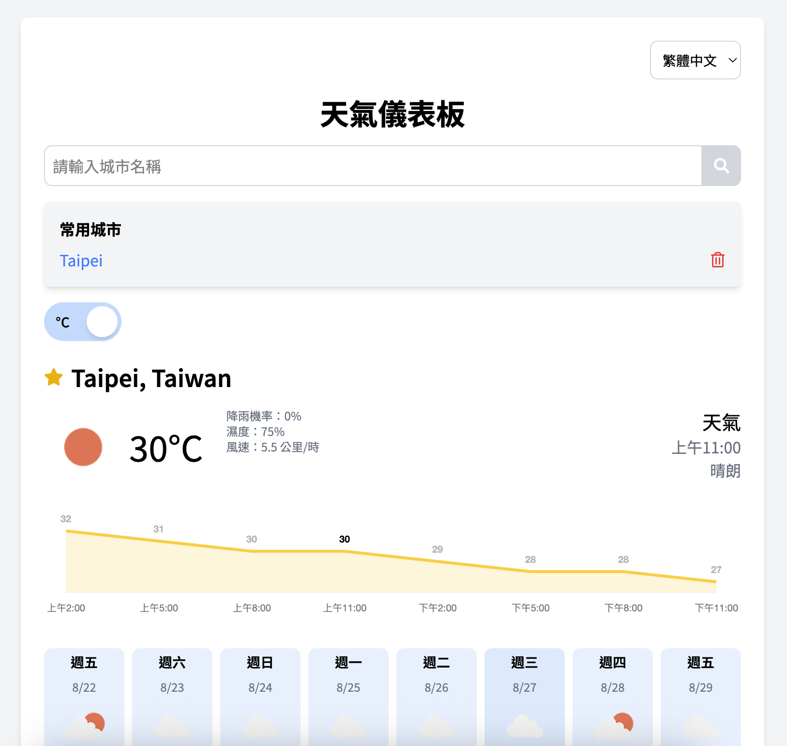

# [Live Weather Dashboard](<https://weather-dashboard-sepia-one.vercel.app/>)

## 專案描述
Weather Dashboard是一個用於顯示城市的即時天氣資訊和五日天氣預報的網頁應用程式。
此專案使用 React、TypeScript、Tailwind CSS、Axios 以及 Open-Meteo API，並採用了 React Context 來管理全域狀態。
提供使用者友好的介面與準確的天氣數據查詢體驗。



## Demo
- **Live Demo**: [Weather Dashboard](https://weather-dashboard-sepia-one.vercel.app/)
- **部署平台**: Vercel

## 天氣代碼與圖示
本專案使用 WMO (World Meteorological Organization) 天氣代碼來表示不同的天氣狀況，包含：

| 代碼 | 天氣描述 |
|------|----------|
| 0 | 晴朗無雲 |
| 1, 2, 3 | 大致晴朗、局部多雲、陰天 |
| 45, 48 | 霧、凝霜霧 |
| 51, 53, 55 | 毛毛雨：小、中、大 |
| 56, 57 | 凍雨：小、大 |
| 61, 63, 65 | 雨：小、中、大 |
| 66, 67 | 凍雨：小、大 |
| 71, 73, 75 | 降雪：小、中、大 |
| 77 | 雪粒 |
| 80, 81, 82 | 陣雨：小、中、大 |
| 85, 86 | 陣雪：小、大 |
| 95 | 雷暴：小至中度 |
| 96, 99 | 伴隨小至大冰雹的雷暴 |

天氣代碼圖示來源: `https://gist.github.com/stellasphere/9490c195ed2b53c707087c8c2db4ec0c`

## 網站功能
- **搜尋城市**：使用者可以輸入城市名稱，查詢該城市的天氣資訊。
- **即時天氣**：顯示當前氣溫、風速、濕度、天氣狀況。
- **五日預報**：提供每日的最高溫、最低溫與天氣狀況。
- **收藏城市**：使用者可將常用城市加入收藏列表，方便快速查詢。
- **溫度單位切換**：支援攝氏與華氏溫度切換，根據使用者偏好顯示對應溫度。
- **響應式設計**：採用 Tailwind CSS，適用於各種裝置與螢幕尺寸。

## 如何在本地運行專案

1. **複製存儲庫**
  ```bash
  git clone https://github.com/kopki123/weather-dashboard.git
  cd ./weather-dashboard
  ```

2. **安裝依賴套件**
  ```bash
  npm install
  ```

3. **啟動開發伺服器**
  ```bash
  npm run dev
  ```

4. **執行測試**
  ```bash
  npm run test
  ```
